# Golang的23种设计模式之代码示例+图解+设计模式资料

## 什么是设计模式?

设计模式是一套理论, 由软件界先辈们总结出的一套可以反复使用的经验, 可以提高代码可重用性, 增强系统可维护性, 以及巧妙解决一系列逻辑复杂的问题(运用套路).

1995 年，艾瑞克·伽马（ErichGamma）、理査德·海尔姆（Richard Helm）、拉尔夫·约翰森（Ralph Johnson）、约翰·威利斯迪斯（John Vlissides）等 4 位作者合作出版了《设计模式：可复用面向对象软件的基础》（Design Patterns: Elements of Reusable Object-Oriented Software）一书，在本教程中收录了 23 个设计模式，这是设计模式领域里程碑的事件，导致了软件设计模式的突破。这 4 位作者在软件开发领域里也以他们的“四人组”（Gang of Four，GoF）匿名著称.

## 项目简介

Go 语言设计模式的实例代码 + 代码图解

项目地址:https://github.com/ssbandjl/golang-design-pattern

## 参考文档: 

- [廖雪峰](https://www.liaoxuefeng.com/wiki/1252599548343744/1281319417937953)
- [图解设计模式](http://c.biancheng.net/view/1397.html)
- [golang-design-patttern](https://github.com/senghoo/golang-design-pattern)

## 创建型模式
* [简单工厂模式（Simple Factory）](./00_simple_factory) 

  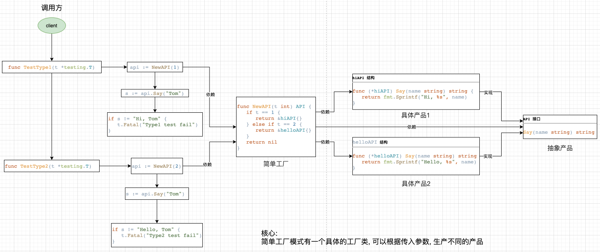

* [工厂方法模式（Factory Method）](./04_factory_method)

  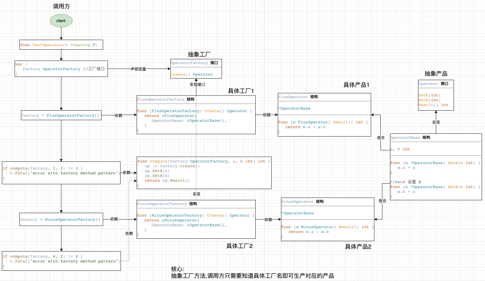

* [抽象工厂模式（Abstract Factory）](./05_abstract_factory)

  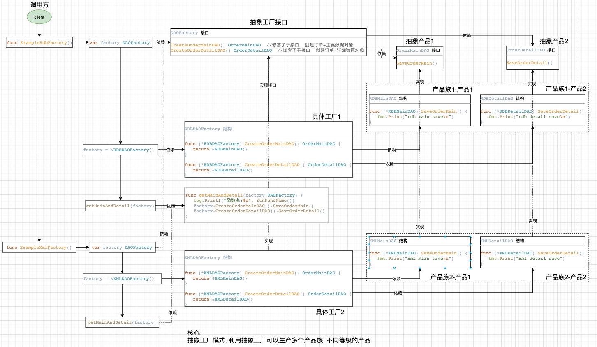

* [创建者模式（Builder）](./06_builder)

  

* [原型模式（Prototype）](./07_prototype)

  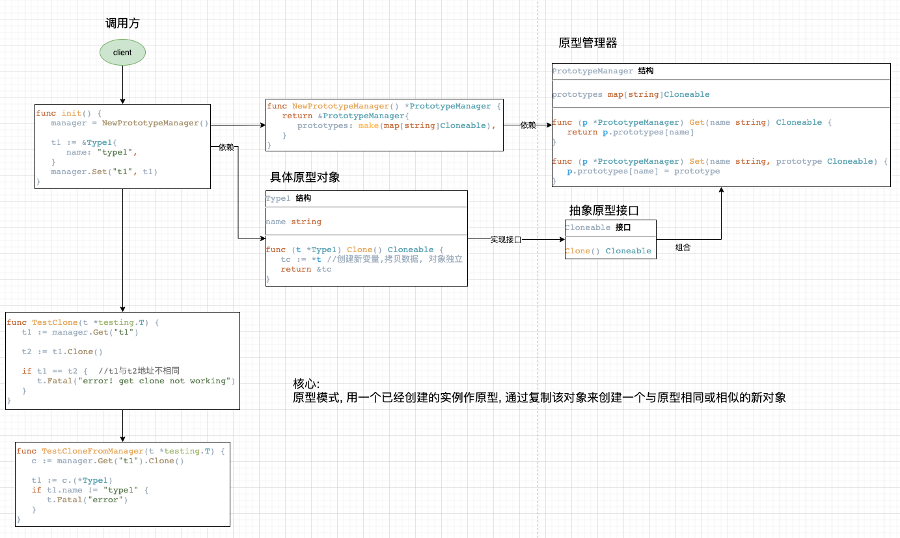

* [单例模式（Singleton）](./03_singleton)

  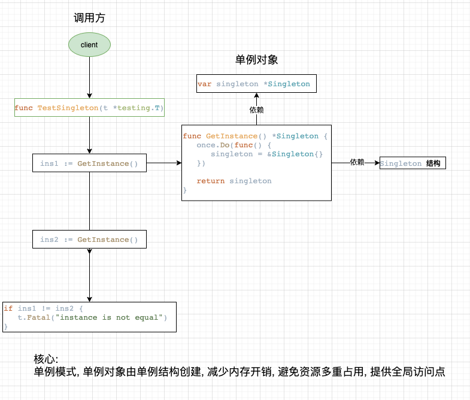

## 结构型模式

* [外观模式（Facade）](./01_facade) 

  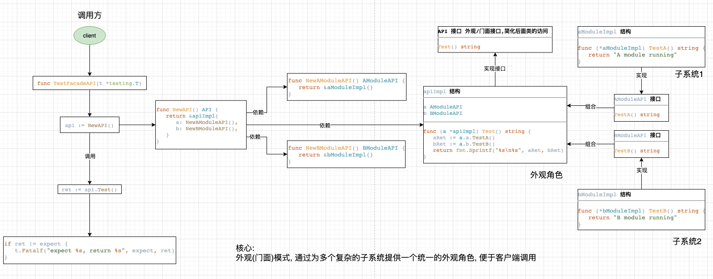

* [适配器模式（Adapter）](./02_adapter)

  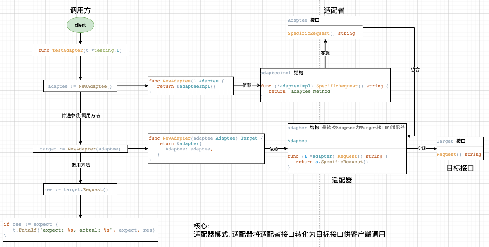

* [代理模式（Proxy）](./09_proxy) 

  

* [组合模式（Composite）](./13_composite)

  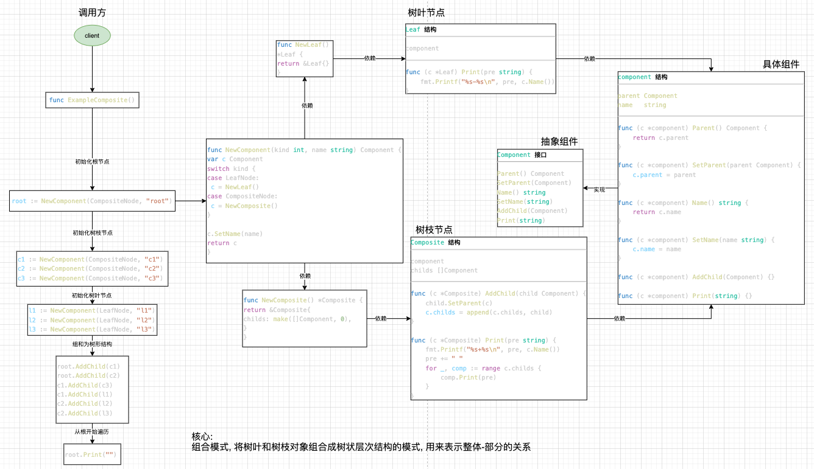

* [享元模式（Flyweight）](./18_flyweight)

  

* [装饰模式（Decorator）](./20_decorator)

  

* [桥接模式（Bridge）](./22_bridge)

  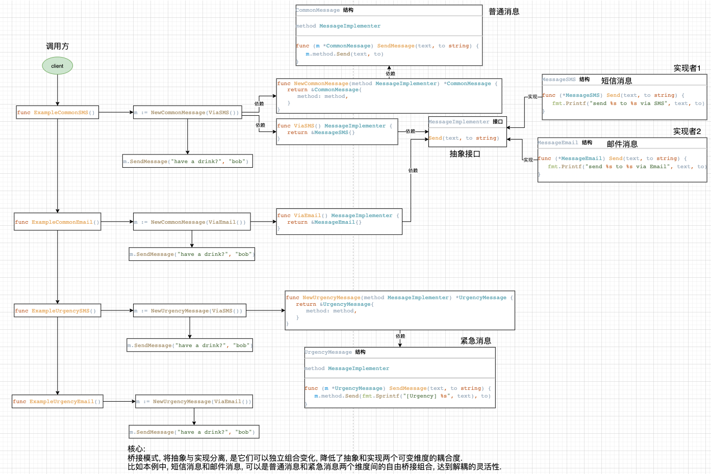

## 行为型模式

* [中介者模式（Mediator）](./08_mediator)

  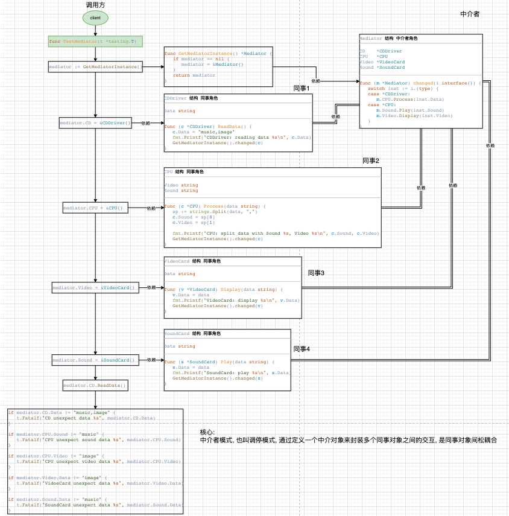

* [观察者模式（Observer）](./10_observer)

  

* [命令模式（Command）](./11_command)

  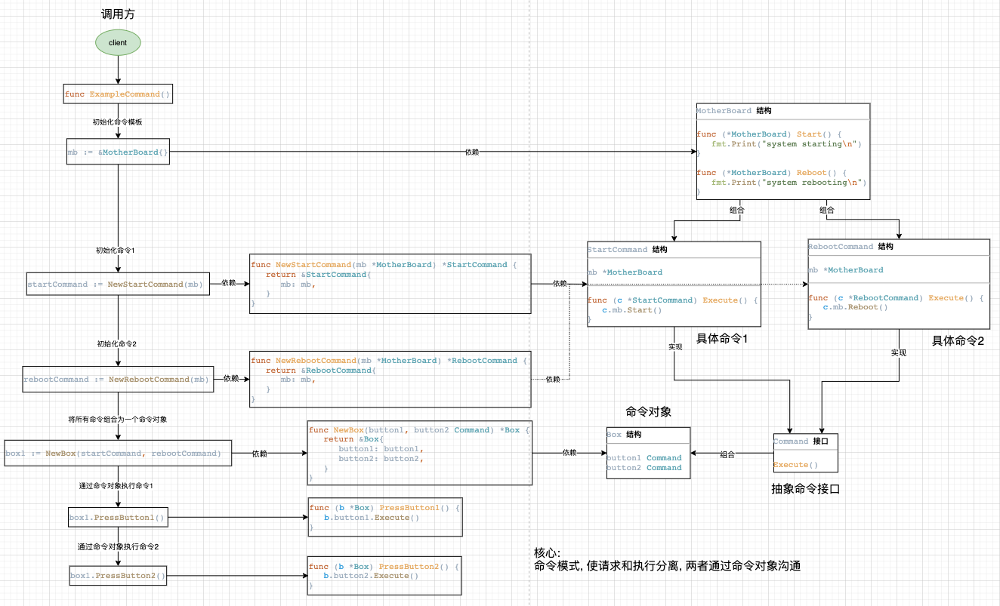

* [迭代器模式（Iterator）](./12_iterator)

  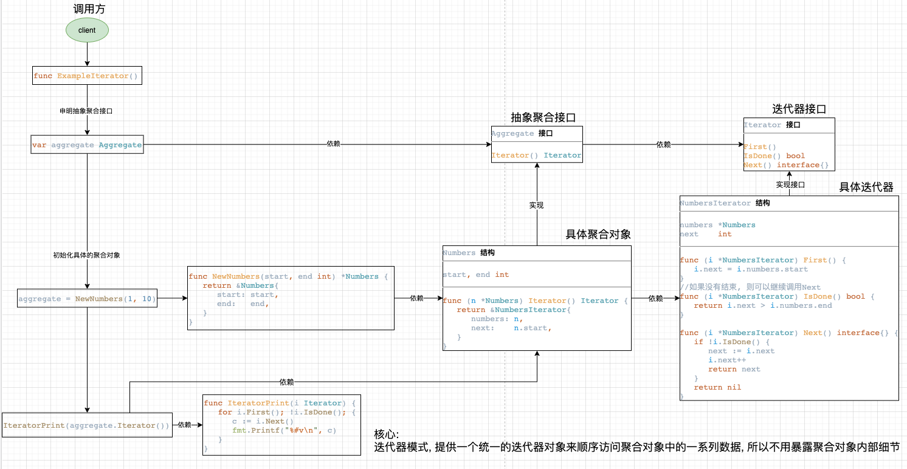

* [模板方法模式（Template Method）](./14_template_method)

  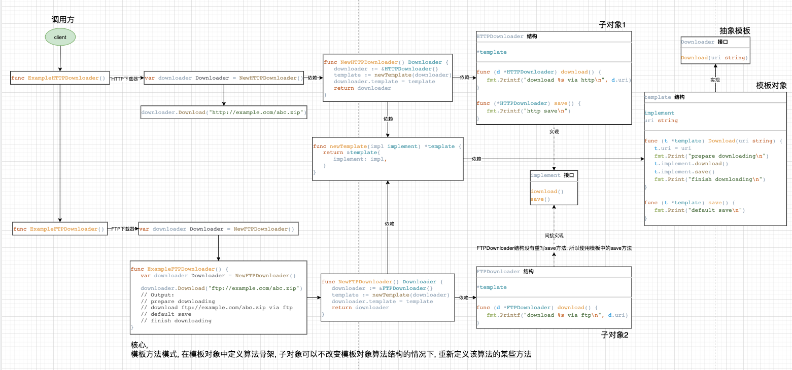

* [策略模式（Strategy）](./15_strategy)

  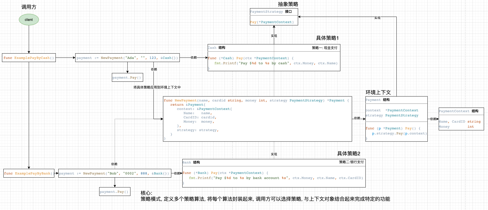

* [状态模式（State）](./16_state)

  

* [备忘录模式（Memento）](./17_memento)

  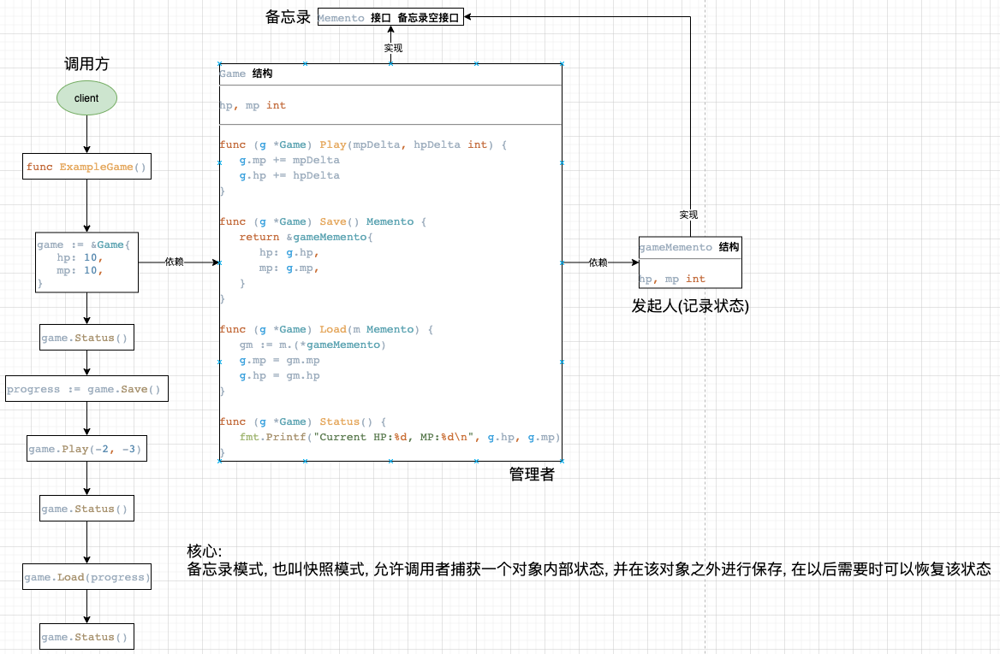

* [解释器模式（Interpreter）](./19_interpreter)

  

* [职责链模式（Chain of Responsibility）](./21_chain_of_responsibility)

  

* [访问者模式（Visitor）](./23_visitor)

  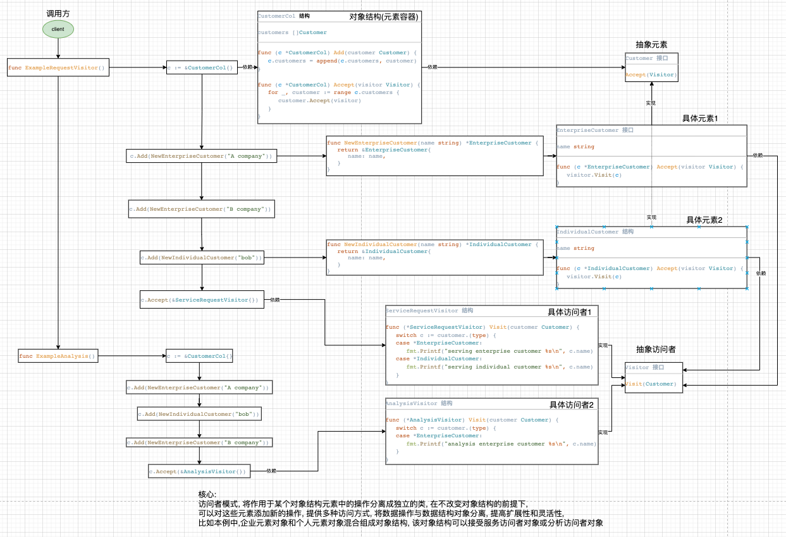

